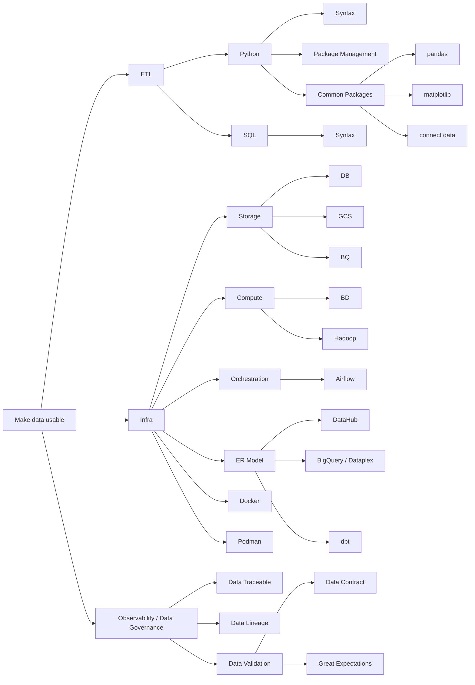

```mermaid
graph LR

A[Make data usable]

A --> B[ETL]
A --> C[Infra]
A --> D[Observability / Data Governance]

%% ETL
B --> B1[Python]
B --> B2[SQL]

B1 --> B11[Syntax]
B1 --> B12[Package Management]
B1 --> B13[Common Packages]

B13 --> B131[pandas]
B13 --> B132[matplotlib]
B13 --> B133[connect data]

B2 --> B21[Syntax]

%% Infra
C --> C1[Storage]
C --> C2[Compute]
C --> C3[Orchestration]

C1 --> C11[DB]
C1 --> C12[GCS]
C1 --> C13[BQ]

C2 --> C21[BD]
C2 --> C22[Hadoop]

C3 --> C31[Airflow]

C --> C4[ER Model]

%% Platform / Stack
C4 --> C41[DataHub]
C4 --> C42[BigQuery / Dataplex]
C4 --> C43[dbt]

%% Dev Environment
C --> C5[Docker]
C --> C6[Podman]

%% Governance
D --> D1[Data Traceable]
D --> D2[Data Lineage]

D --> D3[Data Validation]
D3 --> D31[Data Contract]
D3 --> D32[Great Expectations]
```